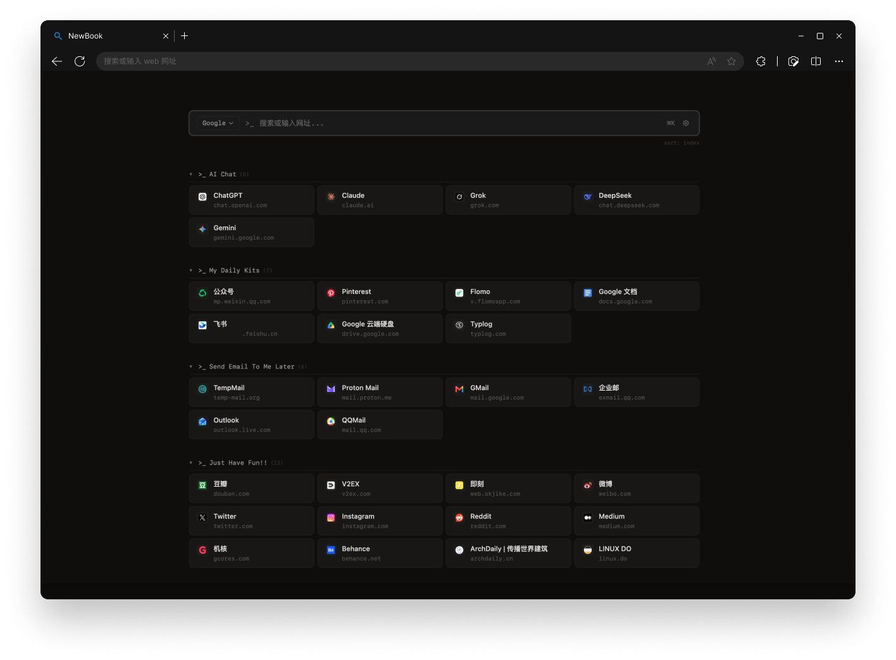

# NewBook


[中文版](README_zh.md)


> A minimalist Chrome extension that replaces the new tab page with a search bar and bookmark cards.


NewBook transforms your browser's new tab page into a clean, terminal-styled dashboard. It reads your bookmarks directly from the browser and displays them as organized cards grouped by folder — no backend, no cloud sync, no tracking.





## Features


- **Multi-engine search** — Google, Bing, DuckDuckGo, GitHub, Stack Overflow, or add your own. Switch engines with a click or `Tab`.

- **Bookmark cards** — bookmarks displayed as responsive cards grouped by folder, with favicons and domain labels.

- **Drag & drop** — move bookmarks between folders or reorder by dragging.

- **Sort modes** — cycle between browser order, alphabetical, or recently added.

- **Multi-theme terminal aesthetics** — four literary themes (Sumi Ink / Rice Paper / Blue Ink / Bamboo), each with a distinct accent color. `>_` prompts, dual-font typography.

- **Power-user shortcuts** — `Ctrl+K` to focus search, middle-click a folder to open all bookmarks, right-click to edit or delete.


## Privacy


NewBook runs entirely on your device — zero network requests, zero data collection.


## Installation


### Download (recommended)


1. Go to [Releases](https://github.com/Cybx233/NewBook/releases) and download `newbook.zip`

2. Unzip the file

3. Open `chrome://extensions/` (or `edge://extensions/`), enable **Developer mode**

4. Click **Load unpacked** and select the unzipped folder

5. Open a new tab — done!


### Build from source


```bash

git clone https://github.com/Cybx233/NewBook.git

cd newbook

npm install

npm run build

```


Then load the `dist/` folder as an unpacked extension.


## Development


```bash

npm run dev     # Build in watch mode (rebuilds on changes)

npm run build   # One-shot production build

```


After running `npm run dev`, reload the extension from `chrome://extensions/` and refresh the new tab page to see changes.


### Tech Stack


- **Vue 3** (Composition API) — UI framework

- **Vite** — Build tool

- **Tailwind CSS v4** — Utility-first CSS with custom terminal theme


## Architecture


```

src/

├── main.js                    # App entry — createApp, mount to #app

├── App.vue                    # Root layout, provide bookmarkMap, lifecycle

├── style.css                  # Tailwind imports + theme token chain + 4 [data-theme] palettes

├── utils/

│   └── safeUrl.js             # URL protocol validation

├── composables/
│   ├── useBookmarks.js        # Bookmark data layer (flat map + live sync)
│   ├── useSearchEngine.js     # Search engine config (presets + storage)
│   └── useTheme.js            # Theme manager (4 themes, cycle + storage.sync)


└── components/

    ├── SearchBar.vue          # Search input + engine switcher + Ctrl+K

    ├── EngineEditor.vue       # Search engine CRUD modal

    ├── BookmarkFolder.vue     # Folder expansion, sub-folder sections, drag target

    ├── BookmarkCard.vue       # Single bookmark card (favicon + interactions)

    └── ContextMenu.vue        # Right-click menu + edit/new/delete modals

```


## Permissions


| Permission | Why |

|-----------|-----|

| `bookmarks` | Read and display your bookmarks; support drag-and-drop reordering, editing, and deleting |

| `storage` | Persist search engine configuration and sort preferences across devices |

| `favicon` | Access Chrome's built-in favicon service to show website icons on bookmark cards |


The extension does **not** request `tabs` or `host_permissions` — it navigates by setting `window.location.href` or `window.open`, not via the Chrome Tabs API.


## License


[GNU General Public License v3.0](LICENSE)


Copyright © 2026
